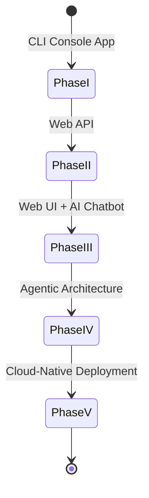
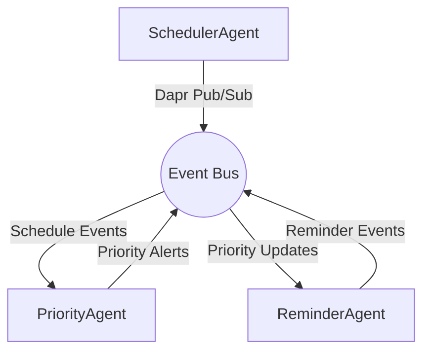
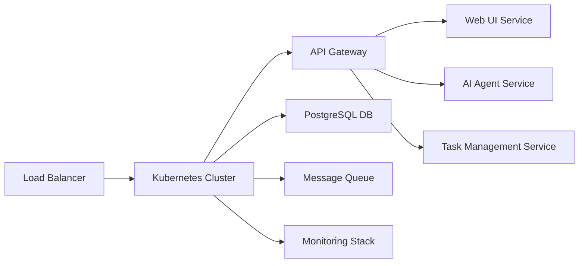

# The Evolution of Todo Constitution

**Version**: 1.0.0 | **Ratified**: 2026-02-07 | **Last Amended**: N/A

## 1. CORE PRINCIPLES

### I. Spec-First Architecture
Every feature and capability must originate from a well-defined specification before any implementation begins. All code generation must flow from validated specifications through automated tools. This ensures architectural consistency and reduces technical debt across all five phases of evolution.

### II. Iterative Spec Refinement
Manual code writing is explicitly forbidden. All implementations must be generated through iterative spec refinement until Claude Code produces correct implementations. This principle enforces discipline in specification quality and promotes reusable, well-documented solutions.

### III. Separation of Concerns
Strict separation must be maintained between specification (Constitution/Specs) and implementation (generated code). Specifications define WHAT and WHY, while implementations handle HOW. This ensures that business logic remains clear and maintainable across all evolution phases.

### IV. Backward Compatibility Guarantee
All phase transitions must maintain backward compatibility. New features and architectural changes must not break existing functionality. This ensures smooth migration paths and preserves user investment in the system.

### V. AI-Centric Design
From Phase III onwards, all system interactions must be designed with AI agents in mind. User interfaces and APIs should facilitate natural language processing and intelligent automation while maintaining human usability.

### VI. Cloud-Native by Design
Architecture must be inherently designed for cloud environments, supporting scalability, resilience, and distributed computing patterns. All components must be containerizable and orchestratable.

### VII. Observability First
Systems must be built with comprehensive monitoring, logging, and tracing capabilities from the ground up. All phases must include mechanisms for performance measurement, error detection, and system health assessment.

## 2. SYSTEM BOUNDARIES & EVOLUTION PATH

### Phase I: CLI Console App (Python + SQLModel)
- **Entry Criteria**: Basic task management requirements defined
- **Exit Criteria**: Full CRUD operations available via command line, in-memory storage validated
- **Validation Checklist**:
  - All CLI commands functional
  - Task lifecycle operations verified
  - Error handling implemented
  - Basic testing coverage achieved

### Phase II: Web API (FastAPI + Neon Serverless DB)
- **Entry Criteria**: Phase I CLI functionality stable and tested
- **Exit Criteria**: RESTful API endpoints available, persistent storage implemented
- **Validation Checklist**:
  - All API endpoints functional
  - Database integration verified
  - Authentication/authorization implemented
  - API documentation generated

### Phase III: Web UI + Basic AI Chatbot (Next.js + OpenAI Chatkit)
- **Entry Criteria**: Phase II API stable and documented
- **Exit Criteria**: Web interface operational, basic AI interactions functional
- **Validation Checklist**:
  - All UI components responsive and accessible
  - AI chatbot understands basic commands
  - Integration with backend API verified
  - User authentication flows complete

### Phase IV: Agentic Architecture (OpenAI Agents SDK + MCP Servers + Kafka/Dapr)
- **Entry Criteria**: Phase III UI and AI chatbot stable
- **Exit Criteria**: Multi-agent system operational, advanced automation capabilities
- **Validation Checklist**:
  - Specialized agents operational (Scheduler, Priority, Reminder)
  - MCP server integrations functional
  - Event streaming implemented
  - Agent communication protocols verified

### Phase V: Cloud-Native Deployment (Minikube → DOKS + Helm + AIOps)
- **Entry Criteria**: Phase IV agentic architecture stable
- **Exit Criteria**: Production-ready deployment on cloud infrastructure
- **Validation Checklist**:
  - Kubernetes manifests complete
  - Helm charts parameterized
  - CI/CD pipelines established
  - Monitoring and alerting configured

## 3. DOMAIN MODEL & DATA CONTRACTS

### TodoTask Data Model Evolution

#### Phase I Schema (v1.0)
```json
{
  "id": "integer",
  "title": "string",
  "description": "string",
  "status": "enum(pending, completed)",
  "created_at": "datetime",
  "updated_at": "datetime"
}
```

#### Phase III Schema (v3.0)
```json
{
  "id": "integer",
  "title": "string",
  "description": "string",
  "status": "enum(pending, completed, in-progress)",
  "priority": "enum(low, medium, high)",
  "tags": "array<string>",
  "created_at": "datetime",
  "updated_at": "datetime"
}
```

#### Phase V Schema (v5.0)
```json
{
  "id": "integer",
  "title": "string",
  "description": "string",
  "status": "enum(pending, completed, in-progress, blocked)",
  "priority": "enum(low, medium, high, urgent)",
  "tags": "array<string>",
  "recurrence_rule": "string (optional)",
  "due_date": "datetime (optional)",
  "assigned_to": "string (optional)",
  "created_by": "string",
  "created_at": "datetime",
  "updated_at": "datetime",
  "completed_at": "datetime (optional)"
}
```

### API Contract Standards
All API contracts must conform to JSON Schema specifications with clear validation rules. Versioning follows semantic versioning principles with backward-compatible changes only.

### Persistence Strategy Evolution
- Phase I: In-memory storage
- Phase II: Neon PostgreSQL serverless
- Phase III: Enhanced PostgreSQL with indexing
- Phase IV: Event-sourced architecture with Kafka
- Phase V: Distributed storage with replication

## 4. AI AGENT ARCHITECTURE

### Phase III: Single-Agent Natural Language Processing
- **Capabilities**: CRUD operations via natural language
- **Communication**: WebSocket connection to backend
- **Safety Constraints**: All operations must pass through validated API endpoints

### Phase IV: Multi-Agent System
- **SchedulerAgent**: Manages task scheduling and recurrence
- **PriorityAgent**: Analyzes and suggests task priorities
- **ReminderAgent**: Handles notifications and reminders
- **Communication Protocol**: Dapr pub/sub topics for inter-agent communication

### Phase V: MCP-Powered Integration
- **Calendar Integration**: Connect to external calendar services
- **Notification Services**: Push notifications and email alerts
- **External Tool Access**: Limited via MCP method signatures

### Safety Constraints
- No direct database access by agents
- All mutations must occur via validated API endpoints
- Agent actions require confirmation for destructive operations

## 5. CLOUD-NATIVE DEPLOYMENT CONTRACT

### Docker Requirements
- Multi-stage builds with distroless base images
- Minimal attack surface with reduced packages
- Proper resource limits and requests defined

### Kubernetes Specifications
- Namespace strategy with resource quotas
- Liveness and readiness probe configurations
- Horizontal pod autoscaling enabled
- Service mesh integration for microservices

### Helm Charts
- Parameterized values.yaml for environment promotion
- Secrets management via external providers
- Rollback capabilities with zero downtime

### DOKS Infrastructure
- DOKS cluster with auto-scaling node pools
- Managed PostgreSQL database
- Load balancer with SSL termination
- Object storage for file uploads

### GitOps Workflow
- Constitution.md → Spec-Kit Plus → kubectl-ai deployment
- Automated deployment via pull request merges
- Infrastructure as code with version control

## 6. VALIDATION & COMPLIANCE

### 3-Tier Validation Framework

#### Tier 1: Spec Validation
- Automated Constitution compliance checking
- Specification syntax and completeness verification
- Cross-reference validation between sections

#### Tier 2: Implementation Validation
- Phase-specific test suites generated alongside code
- Unit, integration, and end-to-end testing
- Performance and load testing requirements

#### Tier 3: Deployment Validation
- kubectl-ai health checks for Kubernetes resources
- Service connectivity verification
- Data integrity and backup validation

### Code Annotation Requirements
All generated code must include `// CONSTITUTION_REF: [section]` annotations linking implementation to constitutional principles.

## 7. EVOLUTION GOVERNANCE

### Amendment Process
- Constitution changes require spec version bump
- Amendments must include rationale and impact assessment
- Approval process involves architectural review board

### Deprecation Policy
- Deprecated features must maintain backward compatibility for minimum 2 release cycles
- Migration paths must be provided for deprecated functionality
- Documentation updates required for all deprecations

### Audit Trail
- All spec refinements must be committed with rationale
- Change logs must document architectural decisions
- Impact assessments required for major changes

## 8. FRONTEND ARCHITECTURE & PAGE CONTRACTS

### Design System Foundation
- Framework: Next.js 14 (App Router), TypeScript, Tailwind CSS
- Component Library: Shadcn/ui (customized with Panaversity indigo/violet palette)
- Accessibility: WCAG 2.1 AA compliant
- Performance: Zero layout shift, dark/light mode support

### Page Specifications

#### Login/Signup (/)
- Clean form with email/password
- "Continue with Google/GitHub" (Phase IV)
- Hackathon theme hero illustration
- Animated gradient border on focus; password strength meter
- Data Flow: POST /api/auth/login → JWT in HttpOnly cookie

#### Dashboard (/dashboard)
- Summary cards (tasks/completed/overdue)
- Agent status indicator (🟢 Online)
- Quick-add task bar
- Completion trend chart (Phase IV)
- Unique UX: "Agent Pulse" visualizer: Real-time agent activity heatmap
- Data Flow: GET /api/dashboard + WebSocket for agent status

#### Task Manager (/tasks)
- Search/filter bar with chip selectors
- Sortable task table (drag handles)
- Priority badges (🔴 High, 🟡 Medium, 🟢 Low)
- Bulk action toolbar
- Unique UX: "Focus Mode": Dim non-urgent tasks; priority-based color coding
- Data Flow: CRUD via /api/tasks; Dapr events for real-time sync (Phase IV+)

#### AI Agent Console (/agent)
- Chat interface with message history
- Context panel (current tasks snippet)
- Capability badges ("I can reschedule tasks")
- Voice input button (Phase IV)
- Unique UX: "Intent Preview": Shows parsed action before execution (e.g., "✅ Will mark 'Report' as complete")
- Data Flow: WebSocket to /api/agent/stream; confirmation modal for mutations

#### Settings (/settings)
- Profile/avatar section
- Agent toggles (Scheduler, Reminder)
- Notification preferences
- Calendar integration OAuth flow (Phase V)
- Unique UX: "Agent Personality" slider: Adjust formality (Casual ↔ Professional)
- Data Flow: PATCH /api/user/settings; MCP tool authorization flows

### Professional Polish
All pages include subtle animated transitions (Framer Motion), skeleton loaders during async ops, and empty states with illustrative SVGs. Error messages are human-readable with recovery paths.

## 9. ARCHITECTURE DIAGRAMS

### 5-Phase Evolution State Diagram


### AI Agent Communication Protocol


### Cloud-Native Infrastructure
